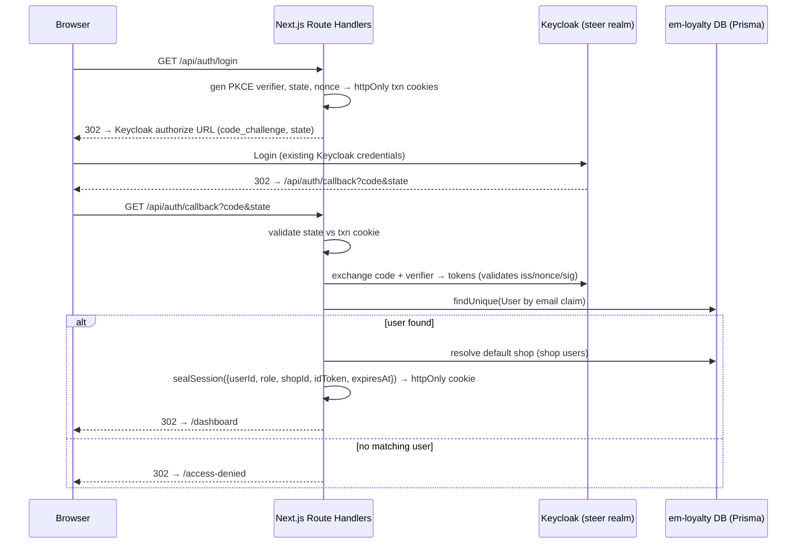
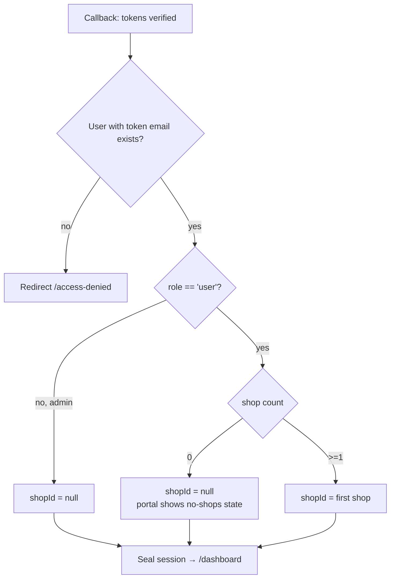

# feat: Keycloak SSO login for em-loyalty portal

**Target repo:** em-loyalty (this repo). All paths below are repo-relative.

---

## Summary

Replace em-loyalty's mock cookie-based login with **Keycloak Single Sign-On** against the **same `steer` realm and the same users** used by Steer Phones, so a user signs into the loyalty portal with their existing Keycloak credentials. Authentication moves to Keycloak; the portal's existing **authorization** model (its Prisma `User.role` + shop associations) is preserved unchanged.

Because em-loyalty is a Next.js 16 App Router app that protects routes **server-side** (server components read a cookie and `redirect`), it cannot reuse the dashboard's client-side `keycloak-js` SPA code verbatim. Instead it implements a **server-side OpenID Connect Authorization Code flow with PKCE** in Next.js Route Handlers, sealing the session in an httpOnly cookie that the existing `getSession()` helper continues to expose as `{ userId, role, shopId }`. Mock login is retained for local development, env-gated exactly like the dashboard.

---

## Problem Frame

The current login (`src/app/(auth)/login/page.tsx`) is a Prisma-backed user picker that POSTs to `src/app/api/auth/mock/route.ts`, which sets a **plaintext, non-httpOnly, unsigned** `mock-session` cookie (`{ userId, role, shopId }`). `getSession()` (`src/lib/session.ts`) trusts whatever JSON is in that cookie. This is fine for a POC but has two problems this work resolves:

1. **No real authentication** — anyone can pick any user; there are no credentials.
2. **Privilege escalation hole** — the cookie is client-readable and client-forgeable. A user can set `{"role":"admin"}` in devtools and `getSession()` will trust it. `src/context/shop-context.tsx` even writes `shopId` into this cookie from client JS today.

The goal: authenticate against the shared Keycloak `steer` realm (so the loyalty portal and Steer Phones share one login and one set of users), while keeping the portal's role/shop authorization intact and closing the forged-cookie hole.

---

## Scope Boundaries

### In scope
- Server-side OIDC Authorization Code + PKCE login/callback/logout against the `steer` realm.
- A sealed (encrypted) httpOnly session cookie replacing the plaintext `mock-session`.
- Mapping a Keycloak identity to an em-loyalty `User` by **email** (deny if no matching user).
- Dual-mode auth (mock for local dev, Keycloak elsewhere), env-gated like the dashboard's `authMode`.
- A server route to switch the active shop (replacing the client-side cookie write that breaks under an httpOnly cookie).
- Introducing a minimal `vitest` harness for the unit-testable auth logic (none exists today).

### Out of scope / Non-goals
- Changing the portal's role model (`admin` / `user`) or shop-association model.
- Redesigning or administering the Keycloak `steer` realm itself.
- Migrating or reconciling existing seeded em-loyalty users beyond email matching.
- Syncing roles/shops from Keycloak claims — authorization stays in the em-loyalty DB.
- Bearer-token-authenticated public API (the portal's `/api/*` routes remain same-origin, cookie-authenticated).

### Deferred to Follow-Up Work
- **JIT user provisioning** — auto-creating an em-loyalty `User` on first Keycloak login. Explicitly rejected for now (deny-if-absent chosen); revisit if onboarding friction warrants it.
- **Optimistic `proxy.ts` redirect** — Next 16's renamed middleware could add a coarse pre-render redirect for unauthenticated users, but security guidance says it must not be the only guard, and the existing server-component guards already cover enforcement. Not needed for correctness.
- **Server-side token store** — if encrypted Keycloak tokens push the session cookie past ~4KB, move tokens to a server-side store keyed by a session id. Only if observed.

---

## Key Technical Decisions

1. **Server-side OIDC code flow + PKCE, not `keycloak-js`** *(user-confirmed)*. em-loyalty guards routes in server components where a browser-memory token is invisible. The flow lives in Route Handlers; the session lives in an httpOnly cookie that server components read. Same realm/client/users as the dashboard; different integration shape because the framework differs.

2. **Use `openid-client@^6` for the flow; `jose` for sealing/verification.** `jose` v6.1.3 is **already present** (transitive dep). `openid-client` v6 (ESM, Node runtime) handles discovery, PKCE URL building, the code→token exchange, state/nonce/`iss`/ID-token validation, refresh, and the end-session URL — removing the highest-risk hand-written code while staying "hand-rolled" (no NextAuth, no `keycloak-js`). Route handlers stay on the **Node.js runtime** (not Edge).

3. **Sealed JWE session cookie, replacing the plaintext cookie.** Seal `{ userId, role, shopId, idToken, expiresAt }` with `jose` `EncryptJWT` (`dir` + `A256GCM`, 256-bit `SESSION_SECRET`). Cookie flags `httpOnly: true`, `secure` (prod), `sameSite: 'lax'`, `path: '/'`. `getSession()` keeps returning `{ userId, role, shopId }`, so the portal layout and every `/api/*` route that reads the session are **untouched**. This also closes the forged-cookie privilege-escalation hole.

4. **Identity from Keycloak, authorization from the em-loyalty DB** (mirrors the dashboard's core principle). At callback, verify the token, then **require `email_verified === true`** and **normalize the email (trim + lowercase)** before `prisma.user.findUnique({ where: { email } })`. **If no user exists, or the email is unverified/blank → deny** (render an access-denied page); never trust Keycloak realm roles for portal authorization. The matched `User.role` and shop associations drive authorization exactly as today. *(The `email_verified` gate prevents an attacker who registers an unverified Keycloak account with a provisioned user's address from inheriting that user's portal access; case-normalization prevents legitimately-provisioned users being locked out by casing differences — Postgres `@unique` is case-sensitive. Seeded emails must be stored lowercase.)*

5. **Dual-mode, env-gated via an allowlist** *(user-confirmed)*. An `authMode` helper resolves to `mock` **only when `APP_ENV === 'local'` AND `AUTH_MODE === 'mock'`** — an allowlist that mirrors `apps/dashboard/src/config.ts` **exactly**; **any** non-`local` value of `APP_ENV` (including unset, `staging`, or a typo) enforces `keycloak`. A denylist form (`APP_ENV !== 'production'`) is explicitly rejected: it would expose the unauthenticated mock user-picker if any non-prod env merely omitted `APP_ENV`. Both modes produce the **same sealed session cookie** via the same `sealSession()`, so all downstream code is mode-agnostic.

6. **Keep server-side guards; do not add `proxy.ts` as the gate.** Route protection stays in `src/app/(portal)/layout.tsx` and per-route `getSession()` checks (defense in depth). CVE-2025-29927 (middleware-bypass) is patched in 16.1.6, but the durable lesson — enforce close to the data — is already how this app works.

7. **Introduce `vitest` for unit-testable logic.** The repo has no test harness today. Session seal/unseal, email→user mapping, `authMode` resolution, and shop-access validation are pure and worth covering. The full OIDC redirect dance is verified manually/integration-style against the dev Keycloak realm (mocking Keycloak end-to-end is out of proportion to the value).

8. **Fixed 8-hour session TTL; token refresh deferred.** `sealSession()` sets `expiresAt = now + 8h` and the JWE `exp`; `getSession()` returns `null` once past it (independent of the JWE structural check), so an expired session cleanly triggers `redirect('/login')`. Access-token `refreshTokenGrant` is **not** wired in this iteration — on expiry the user re-authenticates via Keycloak SSO (typically silent if the Keycloak session is still live). This bounds the credential-theft and stale-authorization windows (KTD-9) to ≤8h. Revisit refresh if the 8h re-SSO proves disruptive.

9. **Authorization is resolved at login and trusted for the session lifetime (bounded by KTD-8).** `role`/`shopId` are baked into the sealed cookie at callback and not re-checked against the DB per request. A revoked or demoted user therefore retains their prior access until the session expires (≤8h) or they re-log in. This is an **accepted risk** for the controlled B2B user base; the 8h TTL is the mitigation. Immediate revocation (per-request DB re-derivation of `role` in the portal layout) is deferred follow-up work.

---

## High-Level Technical Design

### Authentication flow (Keycloak mode)



### Callback decision logic



### Identity vs authorization (unchanged principle)

Keycloak supplies **identity** (`sub`, `email`, `name`). The em-loyalty DB supplies **authorization** (`User.role`, `UserShop`). The session cookie carries only the resolved em-loyalty `{ userId, role, shopId }` (plus `idToken` for logout), so no Keycloak claim is ever trusted for authorization decisions.

---

## Output Structure

```
src/
├── lib/
│   ├── auth/
│   │   ├── config.ts          # NEW: authMode + env resolution (mirrors dashboard config.ts)
│   │   └── oidc.ts            # NEW: cached openid-client discovery config
│   ├── session.ts            # REWRITE: jose-sealed session (sealSession/getSession/clearSession)
│   └── keycloak-verify.ts    # NEW (optional): JWKS verify helper for future bearer use
├── app/
│   ├── api/
│   │   ├── auth/
│   │   │   ├── login/route.ts     # NEW: OIDC initiation (PKCE/state/nonce)
│   │   │   ├── callback/route.ts  # NEW: code→token, email→user map, seal session
│   │   │   ├── logout/route.ts    # NEW: RP-initiated logout
│   │   │   └── mock/route.ts      # MODIFY: seal session, gate to mock mode
│   │   └── session/
│   │       └── shop/route.ts      # NEW: server-side active-shop switch
│   ├── (auth)/login/
│   │   ├── page.tsx               # MODIFY: dual-mode (Keycloak button | mock picker)
│   │   └── login-form.tsx         # MODIFY: mock-mode only
│   ├── access-denied/page.tsx     # NEW: unprovisioned Keycloak user (full RP-logout link)
│   └── (portal)/layout.tsx        # MODIFY: zero-shop handling (no login loop)
├── context/
│   ├── shop-context.tsx           # REWRITE setActiveShop: async call to server route, not document.cookie
│   └── auth-context.tsx           # MODIFY: logout() → /api/auth/logout (keycloak) vs mock DELETE
└── components/layout/
    ├── header.tsx                 # MODIFY: logout wiring per mode
    └── shop-switcher.tsx          # MODIFY: await setActiveShop before router.refresh()
```

*Tree shows the primary source files per unit. Each feature-bearing unit also adds a colocated `*.test.ts` (see per-unit Files), plus root-level `vitest.config.ts` and `.env*` updates in U1.*

---

## Implementation Units

### U1. Foundations: dependencies, env, `authMode`, OIDC discovery, test harness

**Goal:** Establish the shared config and tooling every later unit builds on.

**Requirements:** KTD-2, KTD-5, KTD-7.

**Dependencies:** none.

**Files:**
- `package.json` — add `openid-client@^6`; add `vitest` (+ `@vitejs/plugin-react` only if component tests are added later) and a `"test": "vitest run"` script. (`jose` already present.)
- `vitest.config.ts` — NEW, node environment.
- `src/lib/auth/config.ts` — NEW. `authMode` = `'mock'` **only when `APP_ENV === 'local'` AND `AUTH_MODE === 'mock'`** (allowlist; see KTD-5), else `'keycloak'`. Plus typed accessors for `KEYCLOAK_BASE_URL` (dev reference value: `https://auth.dev2.steercrm.dev`, the same host `apps/dashboard/src/config.ts` defaults `VITE_KEYCLOAK_URL` to), `KEYCLOAK_REALM` (default `steer`), `KEYCLOAK_CLIENT_ID`, `KEYCLOAK_CLIENT_SECRET`, `KEYCLOAK_REDIRECT_URI`, `KEYCLOAK_POST_LOGOUT_URI`, `SESSION_SECRET`. Validate `SESSION_SECRET` decodes to exactly 32 bytes at startup; throw a clear error otherwise.
- `src/lib/auth/oidc.ts` — NEW. Module-cached `openid-client` `discovery()` against `${BASE}/realms/steer`.
- `.env.local.example`, `.env.local`, `.env` — add the new keys (placeholders in the example; the dev `KEYCLOAK_BASE_URL` may be pinned). **Secrets hygiene:** `SESSION_SECRET` and `KEYCLOAK_CLIENT_SECRET` are git-ignored locally (`.env*` already ignored) and must come from the platform secret store (not committed) in staging/prod. Rotating `SESSION_SECRET` invalidates all live sessions by design.
- `src/lib/auth/config.test.ts` — NEW.

**Approach:** Mirror `apps/dashboard/src/config.ts` for the mode-gating shape (allowlist, not denylist). Discovery is cached per server instance (one `Promise<Configuration>`); clear the cache on rejection so retries work. Keep everything on the Node runtime.

**Patterns to follow:** `apps/dashboard/src/config.ts` (authMode allowlist gating), the discovery-cache pattern from research.

**Test scenarios:**
- `authMode` returns `'mock'` when `AUTH_MODE=mock` and `APP_ENV=local`.
- `authMode` returns `'keycloak'` when `APP_ENV=production` (and `AUTH_MODE=mock`) — production never allows mock.
- `authMode` returns `'keycloak'` when `APP_ENV=staging` or any non-`local` value, even with `AUTH_MODE=mock` (allowlist regression guard).
- `authMode` returns `'keycloak'` when `APP_ENV` is **unset** with `AUTH_MODE=mock` (the denylist failure case this guards against).
- `authMode` returns `'keycloak'` when `AUTH_MODE` is unset.
- Config accessor throws when a required Keycloak var is missing in keycloak mode, or when `SESSION_SECRET` is not 32 decoded bytes.

**Verification:** `npm run test` runs; `npm run build` succeeds with the new dep; discovery helper resolves against the dev realm's `.well-known/openid-configuration`.

---

### U2. Sealed session layer (replace the plaintext cookie)

**Goal:** Replace the forgeable `mock-session` JSON cookie with a `jose`-encrypted httpOnly session, while keeping `getSession()`'s public shape so no consumer changes.

**Requirements:** KTD-3 (closes the privilege-escalation hole).

**Dependencies:** U1.

**Files:**
- `src/lib/session.ts` — REWRITE. Export `sealSession(payload)`, `getSession()` → `{ userId, role, shopId } | null`, `clearSession(response)`, and shared cookie name/options constants. Use `EncryptJWT`/`jwtDecrypt` (`dir`/`A256GCM`) with `SESSION_SECRET` (base64 32 bytes).
- `src/lib/session.test.ts` — NEW.

**Approach:** Internal sealed payload is `{ userId, role, shopId, idToken, expiresAt }` (all present — `idToken` carries the Keycloak ID token for logout `id_token_hint`; `expiresAt = now + 8h` per KTD-8). `getSession()` projects to the existing `{ userId, role, shopId }` so `src/app/(portal)/layout.tsx` and all `/api/*` routes that read `session.role`/`session.shopId` are untouched. `sealSession()` sets both the JWE `exp` and `expiresAt`; `getSession()` returns `null` if `expiresAt` is in the past **as well as** on `jwtDecrypt` throwing (belt-and-suspenders so expiry is enforced even if the structural `exp` is ever omitted). Cookie: rename `mock-session` → `session`, `httpOnly: true`, `secure` in prod, `sameSite: 'lax'`, `path: '/'`. A tamper/expiry-induced `null` cleanly triggers existing `redirect('/login')` guards. Cookies can only be **set** in route handlers/server actions (not during server-component render) — `getSession()` only reads, which is allowed.

**Patterns to follow:** `src/lib/session.ts` current `getSession()` signature (preserve it); `jose` `EncryptJWT`/`jwtDecrypt` from research.

**Test scenarios:**
- `sealSession` then decode round-trips `{ userId, role, shopId }`.
- A tampered cookie value yields `null` from `getSession()`.
- A token whose `expiresAt` is in the past yields `null` (TTL enforcement, independent of JWE `exp`).
- A cookie sealed with a different `SESSION_SECRET` yields `null` (integrity).
- `getSession()` returns `null` when no cookie is present.

**Verification:** Existing portal pages still load when handed a validly sealed cookie; a hand-edited cookie is rejected (no longer trusted).

---

### U3. Server-side active-shop switch (replaces the client cookie write)

**Goal:** Provide a server route to change the active shop, since `shop-context.tsx` can no longer write the now-httpOnly session cookie from client JS.

**Requirements:** KTD-3 (sealed cookie is server-only), preserves existing shop-switch UX.

**Dependencies:** U2.

**Files:**
- `src/app/api/session/shop/route.ts` — NEW (POST). Validate the requested `shopId` is one the current user actually has access to (`prisma.userShop`), then re-`sealSession` with the new `shopId`. Require an `application/json` content type (rejects simple cross-site form POSTs — lightweight CSRF mitigation layered on `sameSite: 'lax'`).
- `src/context/shop-context.tsx` — REWRITE `setActiveShop` to be **async**: `await` the POST to the route, returning a promise the caller awaits before refreshing. No more `document.cookie` write.
- `src/components/layout/shop-switcher.tsx` — MODIFY: `await setActiveShop(shop)` **before** calling `router.refresh()` (the current code fires them back-to-back synchronously, which would race the re-seal and re-render the stale shop).
- `src/app/api/session/shop/route.test.ts` — NEW (shop-access validation logic).

**Approach:** This is a **must-land-with U2** coupling: the moment the cookie becomes httpOnly, the existing client-side `document.cookie` write in `setActiveShop` silently breaks. The route reads the current session, confirms `userShop` membership for the target shop (reject with 403 otherwise — prevents a shop user from selecting a shop they don't belong to), re-seals, and returns. Because the re-seal is now a network round-trip, the switcher **must await it** before `router.refresh()`, otherwise the server re-renders with the old `shopId`.

**Patterns to follow:** existing `/api/*` route handlers (`src/app/api/auth/mock/route.ts` cookie-set shape), `src/context/shop-context.tsx` current `setActiveShop` contract.

**Test scenarios:**
- A user with access to shop X can switch to X (session re-sealed with `shopId=X`).
- A user **without** access to shop Y is rejected (403) and the session is unchanged.
- An admin can switch among all shops they were given.
- Unauthenticated request → 401.

**Verification:** With multiple shops, the header shop-switcher changes the active shop and server-rendered data follows; a forged `shopId` for a non-member shop is refused.

---

### U4. Mock login → sealed session + mode gating

**Goal:** Keep mock login working for local dev, but emit the **same sealed session** as Keycloak and refuse to operate outside mock mode.

**Requirements:** KTD-5, KTD-3.

**Dependencies:** U2, U1.

**Files:**
- `src/app/api/auth/mock/route.ts` — MODIFY. Use `sealSession()` instead of `JSON.stringify`; on `DELETE` use `clearSession`. Return 404/403 when `authMode !== 'mock'`.
- `src/app/api/auth/mock/route.test.ts` — NEW (mode gating + session shape).

**Approach:** Unifies the session format across both auth modes so all downstream code is mode-agnostic. Mock route still picks a Prisma user + optional shop, but now seals `{ userId, role, shopId }`. Gating ensures the insecure-by-design mock path can never run in production.

**Patterns to follow:** existing `src/app/api/auth/mock/route.ts` POST/DELETE structure.

**Test scenarios:**
- POST in mock mode seals a valid session for a known user.
- POST with an unknown `userId` → 404 (existing behavior preserved).
- POST/DELETE when `authMode='keycloak'` → 404/403 (mock disabled outside local).
- DELETE clears the session cookie.

**Verification:** Local dev login via the picker still works end-to-end and produces a sealed cookie; the route is inert when `AUTH_MODE` is not `mock`.

---

### U5. Keycloak login + callback (PKCE, email→user mapping, deny-if-absent)

**Goal:** Implement the OIDC Authorization Code + PKCE login initiation and callback, including the identity→user mapping and the access-denied path.

**Requirements:** KTD-1, KTD-2, KTD-4.

**Dependencies:** U1, U2.

**Files:**
- `src/app/api/auth/login/route.ts` — NEW (GET). Build PKCE verifier/challenge, `state`, `nonce`; stash them in short-lived httpOnly transaction cookies; redirect to the Keycloak authorize URL.
- `src/app/api/auth/callback/route.ts` — NEW (GET). Validate `state` vs cookie, exchange code (`authorizationCodeGrant` validates `iss`/`nonce`/signature), run the mapping, `sealSession`, clear transaction cookies, redirect to `/dashboard`. Deny result → redirect `/access-denied`.
- `src/app/access-denied/page.tsx` — NEW. Branded "your account isn't provisioned for this portal — contact your administrator" page whose only action is a **full RP-initiated logout** link (to `/api/auth/logout`), not a bare cookie clear. This avoids a loop: a valid-but-unprovisioned Keycloak user still has a live Keycloak SSO session, so a link back to `/login` would re-authenticate them straight into `/access-denied` again (see U6).
- `src/app/api/auth/callback/mapping.ts` + `mapping.test.ts` — NEW. Extract the pure "claims + shops → session payload | deny" decision so it is unit-testable apart from the HTTP/Keycloak machinery.

**Approach:** Transaction cookies (`oidc_verifier`/`oidc_state`/`oidc_nonce`): `httpOnly`, `secure` (prod), `sameSite: 'lax'` (lax, not strict — the callback is a top-level cross-site return), short `maxAge` (~10 min), deleted immediately after exchange. `redirect_uri` must exactly match the value registered on the Keycloak client. The mapping (per KTD-4): require `email_verified === true`, normalize the email (trim + lowercase), then look up the `User`; **only** the matched em-loyalty `User.role`/shops feed authorization. Default-shop resolution follows the callback decision flowchart (admin → null; shop user → first shop, or null when zero shops). Keep handlers on the Node runtime; call `redirect()` outside any try/catch.

**Execution note:** Implement the pure mapping (`mapping.ts`) test-first; the HTTP handlers are verified by integration/manual run against the dev realm.

**Patterns to follow:** `apps/dashboard/src/auth/keycloak-adapter.ts` (identity-vs-authorization split, `'steer'` realm), the route-handler flow from research (`buildAuthorizationUrl`, `authorizationCodeGrant`).

**Test scenarios** (on `mapping.ts`):
- Verified email matches an admin user → session `{ userId, role:'admin', shopId:null }`.
- Verified email matches a shop user with one shop → `shopId` = that shop.
- Verified email matches a shop user with multiple shops → `shopId` = first shop (deterministic order).
- Verified email matches a shop user with zero shops → `shopId:null` (portal handles the no-shops state, U7).
- `email_verified === false` → deny result (even if a matching user exists — identity-spoofing guard).
- Email differing only by case/whitespace from the stored `User.email` → resolves the user (normalization).
- Verified email matches no user → deny result (callback redirects to `/access-denied`).
- Missing/blank email claim → deny result.

**Verification:** A real Keycloak user whose verified email exists in the em-loyalty DB completes login and lands on `/dashboard` with correct role/shop; a valid Keycloak user with no em-loyalty record lands on `/access-denied` and can fully sign out from there; `state` mismatch is rejected.

---

### U6. Logout (RP-initiated) + UI wiring

**Goal:** Sign the user out of both the portal and Keycloak, and wire the logout control to the right path per mode.

**Requirements:** KTD-1, KTD-5.

**Dependencies:** U2, U5.

**Files:**
- `src/app/api/auth/logout/route.ts` — NEW (GET). Build the Keycloak `end_session_endpoint` URL with `id_token_hint` (from the sealed session) and a registered `post_logout_redirect_uri`; clear the session cookie; redirect.
- `src/context/auth-context.tsx` — MODIFY `logout()` to hit `/api/auth/logout` (keycloak mode) vs the mock `DELETE` (mock mode).
- `src/components/layout/header.tsx` — MODIFY the logout control if needed to use the updated context.

**Approach:** Provide `id_token_hint` so Keycloak skips the "confirm logout?" page and honors `post_logout_redirect_uri` (which must be registered on the client). Clearing the local cookie is essential — Keycloak SSO logout alone doesn't drop the app session. **Guard the route:** if `authMode === 'mock'` or the sealed session has no `idToken`, clear the cookie and redirect to `/login` without constructing the end-session URL (avoids an undefined `id_token_hint` erroring or showing Keycloak's confirm page). Mode is read from `authMode` so the same control works in both environments.

**Patterns to follow:** `apps/dashboard/src/auth/keycloak-adapter.ts` `logout()` (end-session + redirect), existing `auth-context.tsx` `logout()` contract.

**Test scenarios:**
- Logout route clears the session cookie (subsequent `getSession()` → `null`).
- Logout route builds an end-session URL containing `id_token_hint` and the post-logout redirect.
- Logout route with a session that has no `idToken` (or in mock mode) clears the cookie and redirects `/login` without an end-session URL.
- In mock mode, `auth-context` logout calls the mock `DELETE` path, not Keycloak.

**Verification:** After logout, the user is bounced to Keycloak's end-session and returned to `/login`; re-visiting a portal route requires a fresh login; no stale session cookie remains.

---

### U7. Login page dual-mode + portal layout zero-shop handling

**Goal:** Present the correct entry UI per mode and prevent a redirect loop for shop users with no selectable shop under Keycloak.

**Requirements:** KTD-5, KTD-4.

**Dependencies:** U5, U4.

**Files:**
- `src/app/(auth)/login/page.tsx` — MODIFY. In keycloak mode render a single "Sign in with Keycloak" action linking to `/api/auth/login`; in mock mode render the existing Prisma user picker. Gate on `authMode`. In keycloak mode, skip the Prisma user/shop queries.
- `src/app/(auth)/login/login-form.tsx` — MODIFY to be mock-mode only (no behavior change in mock mode).
- `src/app/(portal)/layout.tsx` — MODIFY. Replace `if (user.role === "user" && !session.shopId) redirect("/login")` with: if a shop user has **zero** shops, render a friendly "no shops assigned" state (mirroring the login form's existing message) instead of redirecting to `/login` — under Keycloak, redirecting to `/login` would re-trigger auth and bounce back into the portal (a loop).

**Approach:** Keeps the existing mock UX entirely intact for local dev while giving real environments a single SSO entry. The portal-layout change is the one behavioral edge the new flow introduces: shop selection now happens at callback (default first shop) rather than at the login form, so the only remaining "no shop" case is a genuinely shop-less user, which must render a terminal state, not loop. Note that for **multi-shop** users this silently picks the first shop where the mock form used to prompt — the existing header `shop-switcher.tsx` (renders only when `shops.length > 1`) remains the correction path, so ensure the active shop name is visibly displayed in the header. Acceptable because most portal users map to a single shop; a dedicated post-login shop-picker is deferred follow-up if multi-shop users prove common.

**Patterns to follow:** existing `src/app/(auth)/login/page.tsx` branding/layout; the "not associated with any shops" copy already in `login-form.tsx`.

**Test scenarios:**
- `Covers` mode gating: in keycloak mode the login page exposes the Keycloak action and runs no Prisma user query; in mock mode it renders the picker. (Verified via the `authMode`-branched render; component test optional.)
- Portal layout: a shop user with zero shops renders the no-shops state (no redirect).
- Portal layout: an admin (no shop required) loads normally.
- Portal layout: a shop user with a valid `shopId` loads their shop scope.

**Verification:** In keycloak mode `/login` shows the SSO button and starts the flow; a shop-less user sees a clear message rather than an infinite redirect; mock mode is visually and behaviorally unchanged.

---

## Risks & Dependencies

### External / prerequisite dependencies (cannot be done from this repo)
- **Keycloak client registration (blocking for keycloak mode).** A confidential OIDC client must exist in the `steer` realm with: the exact `redirect_uri` (`.../api/auth/callback`), valid **post-logout redirect URIs** (`.../login`), `S256` PKCE enabled, and a client secret provisioned into `KEYCLOAK_CLIENT_SECRET`. This requires Keycloak admin access and is **not verifiable from this repo** — confirm with whoever administers the `steer` realm before keycloak mode can be tested. The dashboard uses client `phones-dashboard-app`; em-loyalty should get its **own** client (e.g. `em-loyalty-app`) rather than reusing the dashboard's public SPA client.
- **`SESSION_SECRET`** (base64 32-byte key) must be generated and set per environment.

### Risks
- **Keycloak `aud` claim.** Keycloak access tokens often carry `aud: "account"` rather than the client id. If U5's optional JWKS verification (`src/lib/keycloak-verify.ts`) is used, verify `azp` or add a realm audience mapper — don't hard-set `audience` to the client id or verification fails. (The primary flow relies on `openid-client`'s ID-token validation, which sidesteps this.)
- **Cookie size.** The sealed cookie carries the `idToken` (a JWT with PII claims) → risks exceeding the ~4KB browser limit → silent cookie drop → "random" lost sessions. Mitigation: store only `idToken` + the minimal app payload; **assert the sealed cookie length at seal time and log/throw if it approaches 4KB** rather than discovering it in production; if it grows, move tokens to a server-side store (deferred follow-up). Note the `idToken` is decryptable only with `SESSION_SECRET`, so a secret leak also exposes those PII claims.
- **Authorization revocation window (accepted, per KTD-9).** Because `role`/`shopId` are baked into the session at login, a user disabled or demoted in Keycloak or the em-loyalty DB retains prior access until the session expires (≤8h, KTD-8) or re-login. Accepted for the controlled B2B user base; per-request DB re-derivation is deferred follow-up. Keycloak SSO logout does **not** drop the em-loyalty cookie (and vice versa) — the app session is independent.
- **Pre-existing invoice IDOR (not introduced here, but now the dominant boundary).** `POST /api/invoices` reads `shopId` from the request body and writes it without a `userShop` membership check — a shop user can create an invoice credited to a shop they don't belong to. This plan closes the forged-cookie vector but explicitly leaves `/api/*` authorization unchanged, so this gap remains. **Deferred to follow-up**: add a `userShop` membership assertion in `POST /api/invoices` (and audit sibling routes that accept a body `shopId`). Flagged here because it ties to financial loyalty balances.
- **Email mismatch between Keycloak and em-loyalty.** Deny-if-absent means a user whose Keycloak email differs (beyond case/whitespace, which KTD-4 normalizes) from their em-loyalty `User.email` is locked out. Acceptable for a controlled B2B portal; surfaced clearly via `/access-denied`. Seed/data alignment is an operational concern.
- **Open-redirect on a future `returnTo` (deferred guard).** The callback hardcodes `/dashboard` today — no open-redirect exists. If a `returnTo`/`next` param is ever added (e.g. with the deferred `proxy.ts` optimistic redirect), it must be validated server-side as a same-origin relative path (`/`-prefixed, no `//`, no scheme) before use. Recorded so the future change doesn't reintroduce the vector.
- **Next 16 cookie-set constraint.** Cookies can only be set in route handlers/server actions — all session writes live in route handlers by design; no server-component sets a cookie.

---

## Sources & Research

- `apps/dashboard/src/auth/` (keycloak-adapter, mock-adapter, AuthProvider, config) — reference implementation; realm `steer`, identity-vs-authorization split, env-gated dual mode.
- [openid-client v6 (PKCE, Node runtime, ESM)](https://github.com/panva/openid-client) — flow primitives (`discovery`, `buildAuthorizationUrl`, `authorizationCodeGrant`, `refreshTokenGrant`, `buildEndSessionUrl`).
- [jose v6](https://github.com/panva/jose) — `EncryptJWT`/`jwtDecrypt` session sealing; `createRemoteJWKSet`/`jwtVerify` for token verification. Already installed (6.1.3).
- [Next.js `cookies()`](https://nextjs.org/docs/app/api-reference/functions/cookies) — async in 16; set only in route handlers/actions.
- [Next.js authentication guide](https://nextjs.org/docs/app/guides/authentication) and [proxy.js (ex-middleware)](https://nextjs.org/docs/app/api-reference/file-conventions/proxy) — `middleware.ts`→`proxy.ts` rename in Next 16; enforce close to data, not solely in middleware/proxy.
- [Keycloak OIDC endpoints](https://www.keycloak.org/securing-apps/oidc-layers) — realm `steer` authorize/token/jwks/end-session paths.
- [CVE-2025-29927 (Next.js middleware bypass)](https://securitylabs.datadoghq.com/articles/nextjs-middleware-auth-bypass/) — patched in 16.1.6; reinforces server-component/route-handler guards.
