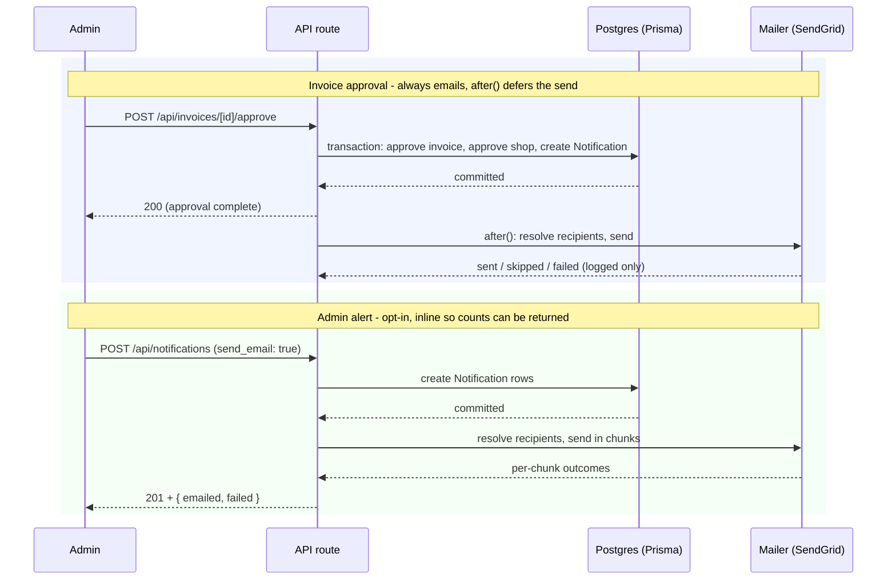
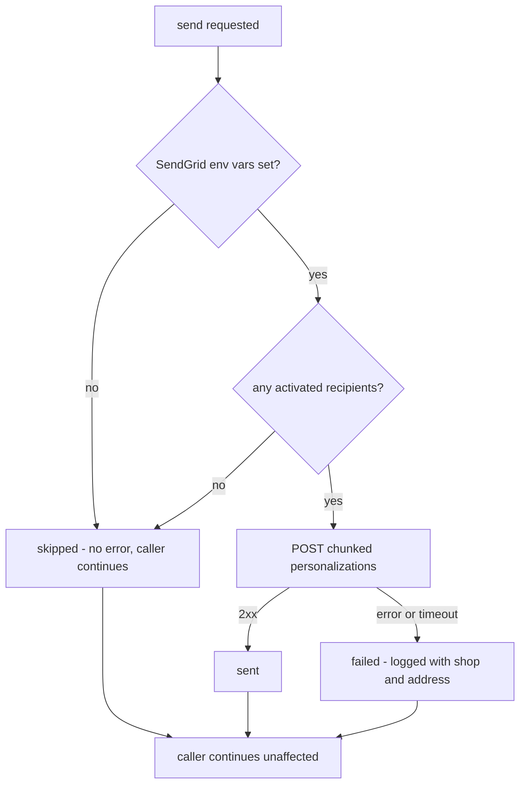

# Email Notifications - Plan

## Goal Capsule

**Objective:** Deliver the portal's existing in-app alerts by email as well, through SendGrid, without changing what alerts exist or how they behave in the app.

**Authority hierarchy:** Product Contract requirements (R-IDs) govern behavior. Key Technical Decisions (KTD-IDs) govern mechanism within those requirements. Implementation Units override neither.

**Stop conditions — surface as a blocker rather than guessing:**

- SendGrid domain authentication is unavailable and the plan's config-optional path cannot be verified end to end.
- A requirement here conflicts with the alert behavior already shipped in `src/lib/notifications.ts` or `src/app/api/notifications/route.ts`.
- Sending email would require holding open, extending, or reordering the invoice-approval transaction.

**Execution profile:** Sequential. U1 through U3 are independent libraries; U4 and U5 wire them into the two trigger paths; U6 is configuration and operator documentation.

**Tail ownership:** Standalone — the implementer owns review, commit, and PR.

---

## Product Contract

### Summary

Add email as a second delivery channel for the alerts the portal already creates. Shop-approval alerts always email; admin-sent alerts email when the admin opts in on that send. Recipients are the activated users attached to the target shop. Sending is optional by configuration and best-effort, so an email failure never affects the action that produced the alert.

### Problem Frame

The portal builds alerts but only shows them inside the app. A shop owner who does not log in never learns that their enrollment was approved, and an admin broadcast reaches nobody who is not already visiting the dashboard. The alert system (per-shop `Notification` rows, a bell in the header, an admin "Send Alerts" page) shipped 2026-07-24 and works — the gap is reach, not the alert model.

The portal has no email capability at all today. The only mail it causes is the Keycloak set-password invite, sent indirectly by the AutoOps identity-functions service, which cannot send arbitrary messages. There is no provider dependency, no SMTP configuration, and no template layer.

### Requirements

**Sending infrastructure**

- R1. The portal sends transactional email through SendGrid.
- R2. Email is optional by configuration. With the SendGrid environment variables unset, every send resolves to a skipped outcome and no caller fails. Local development and test runs work without credentials.
- R3. An email failure never fails, delays, or rolls back the action that triggered the alert.

**Triggers and recipients**

- R4. When a shop's initial invoice is approved, the shop-approved alert is emailed. This is not admin-optional.
- R5. An admin-sent alert is emailed only when the admin opts into email on that send. The default is off.
- R6. Recipients are every user linked to the target shop whose account is activated. A user still awaiting registration approval is excluded.
- R7. A broadcast alert emails the activated users of every shop. Each recipient is addressed individually — no shared `To` and no `BCC`.

**Operations**

- R8. An admin who sends an alert with email enabled sees how many recipients were emailed and how many failed.
- R9. A failed send is logged with the shop and recipient address, so an operator can identify who did not receive the message.

### Scope Boundaries

In-app alerts stay the system of record. Email is an additional channel over the same `Notification` content — this plan adds no alert types and changes no existing alert behavior.

#### Deferred to Follow-Up Work

- Per-user email preferences and an unsubscribe surface.
- Delivery receipts, bounce handling, open tracking, retries, and an outbox table.
- Digest or batched summary email.
- Email for events that have no in-app alert today.

---

## Planning Contract

### Key Technical Decisions

- KTD1. Send through SendGrid using the official `@sendgrid/mail` Node SDK. *(session-settled: user-directed — chosen over Resend, AWS SES, and Postmark: SendGrid is already the organization's email provider, so account, billing, and procurement are settled.)* Governs R1.
- KTD2. The mailer is optional by configuration and never throws. It exposes a configured check and a send that resolves to `"sent"`, `"skipped"`, or `"failed"`. Mirror `src/lib/identity/identity-functions.ts`, which established this posture for an optional external dependency. Governs R2, R3.
- KTD3. Email sends after the database write commits, never inside a Prisma transaction. The two trigger paths differ in how they wait:
  - Invoice approval uses `after()` from `next/server`, so the approving admin's response is not delayed by SendGrid.
  - Admin alert sends run inline before the response, because the admin is waiting and R8 requires per-send counts in that response.

  Governs R3, R8.
- KTD4. A recipient is a user joined to the shop through `UserShop` whose `registration_pending` is `false`. Do not gate on `keycloak_id` — an invited user who has not logged in yet still has a valid mailbox and should receive mail. Governs R6.
- KTD5. Fan-out uses SendGrid personalizations, chunked at 500 recipients per request, one request per chunk. Personalizations give each recipient their own `To` header, satisfying R7 without per-recipient API calls. A few hundred shops is one or two requests.
- KTD6. The email opt-in is a request-time field on the notification create schema. No migration, no new column, and nothing recorded about whether a given alert was emailed — best-effort delivery has no state worth persisting. Governs R5.
- KTD7. Mail sends from a dedicated subdomain (for example `mail.premiumgrowth.mobil.com`) authenticated by SendGrid's CNAME-based domain authentication, not from the apex domain. This isolates the parent domain's existing SPF and DMARC posture from portal mail. See Risks & Dependencies — this is an external prerequisite, not implementation work.
- KTD8. One template shape serves every alert: the notification `title` becomes the subject, the `body` becomes the text part, and a minimal branded HTML part wraps the same body. Alerts are already written as title-plus-body prose, so per-type templates would add a maintenance surface with nothing to put in it.

### Assumptions

These are un-validated bets. Confirm each against current documentation during implementation rather than treating it as settled.

- The SendGrid account, API key, and sending subdomain are provisioned by whoever owns the Mobil DNS zone. The implementer is not blocked on this: the config-optional path (KTD2) lets every unit be built and tested with no credentials present.
- **The 500-recipient chunk in KTD5 is a conservative guess, not a verified limit.** SendGrid's documented ceiling is higher, and the per-request personalization cap plus the plan's rate limits should be read from current SendGrid documentation before U1 is written. Chunking is required either way; only the number is open. Make it a named constant so it can be corrected in one place.
- **`after()` completion semantics were not verified against the deployment target.** The plan assumes work scheduled with `after()` runs after the response on this app's hosting, and may be dropped if the process terminates first. Confirm the behavior for however this portal is actually deployed. If `after()` turns out to be unreliable there, the fallback is a non-awaited inline send with a caught rejection — the same best-effort guarantee, without the deferral.
- The Mobil brand assets available for the HTML email part are whatever the portal already ships. If none are usable inline, the plain text-plus-minimal-HTML shape in KTD8 still satisfies every requirement.

---

## High-Level Technical Design

Both trigger paths reuse the same three libraries and differ only in where the send happens relative to the response.

The mailer resolves one of three outcomes, and only one of them is an error:

---

## Implementation Units

### U1. SendGrid mailer, optional by config

**Goal:** A send function that works without credentials and never throws.

**Requirements:** R1, R2, R3 (KTD1, KTD2, KTD5)

**Dependencies:** none

**Files:**

- `src/lib/email/mailer.ts` (new)
- `src/lib/email/mailer.test.ts` (new)
- `package.json` (add `@sendgrid/mail`)

**Approach:**

1. Export `emailConfigured()` returning true only when the API key and from-address are both set, mirroring `identityFunctionsConfigured()` in `src/lib/identity/identity-functions.ts`.
2. Export a send function taking a subject, text/HTML body, and a recipient list. Resolve `"skipped"` when unconfigured or the recipient list is empty.
3. Chunk recipients at 500 and issue one SendGrid request per chunk using personalizations, so each recipient gets their own `To`.
4. Catch every error, log it with the recipient addresses, and resolve `"failed"`. Never rethrow.
5. Apply a request timeout consistent with `REQUEST_TIMEOUT_MS` in the identity-functions client.

**Patterns to follow:** `src/lib/identity/identity-functions.ts` — the configured-check, the never-throw contract, and the string-union outcome type.

**Test scenarios:**

- Unconfigured environment resolves `"skipped"` and issues no SendGrid call.
- Configured environment with an empty recipient list resolves `"skipped"` and issues no call.
- A successful send resolves `"sent"` and passes each recipient as a separate personalization.
- 501 recipients produce exactly two requests, split 500 and 1.
- A SendGrid error resolves `"failed"`, does not throw, and logs the recipient addresses.
- A timeout resolves `"failed"` rather than hanging the caller.

**Verification:** The mailer's tests pass with no SendGrid credentials present in the environment.

### U2. Recipient resolution

**Goal:** Turn a shop ID into the email addresses that should receive its alerts.

**Requirements:** R6 (KTD4)

**Dependencies:** none

**Files:**

- `src/lib/email/recipients.ts` (new)
- `src/lib/email/recipients.test.ts` (new)

**Approach:**

1. Export a function taking one or more shop IDs and returning recipients grouped by shop.
2. Query `UserShop` joined to `User`, filtering `registration_pending: false`, selecting email and name.
3. Return an empty list for a shop with no activated users rather than throwing — U1 already treats an empty list as skipped.
4. Support the broadcast case in one query over all shops, so U5 does not issue a query per shop.

**Patterns to follow:** the Prisma access shape in `src/app/api/notifications/route.ts`; mock `@/lib/prisma` in tests the way `src/app/api/session/shop/route.test.ts` does.

**Test scenarios:**

- A shop with two activated users returns both addresses.
- A user with `registration_pending: true` is excluded.
- A user linked to a different shop is not returned for this shop.
- A shop with no activated users returns an empty list, not an error.
- The multi-shop query groups recipients by shop and issues a single database call.

**Verification:** Tests pass; the multi-shop path is proven to issue one query, not one per shop.

### U3. Alert email rendering

**Goal:** Render a notification's title and body into subject, text, and HTML.

**Requirements:** R1 (KTD8)

**Dependencies:** none

**Files:**

- `src/lib/email/templates.ts` (new)
- `src/lib/email/templates.test.ts` (new)

**Approach:**

1. Export a render function taking a notification's title and body and returning subject, text, and HTML.
2. Keep the HTML minimal and inline-styled — a Mobil-branded header, the body, and a plain footer identifying the Premium Growth Portal. No external stylesheet or image host.
3. Escape the body when interpolating it into HTML. Admin-authored alert bodies are free text from `notificationCreateSchema`.
4. Preserve the text part as the raw body so the plain-text alternative always matches.

**Test scenarios:**

- Subject equals the notification title.
- The text part equals the notification body unmodified.
- A body containing `<script>` or `&` is escaped in the HTML part and left raw in the text part.
- A multi-line body renders as separate paragraphs or line breaks in HTML.

**Verification:** Tests pass; rendering a `SHOP_APPROVED_NOTIFICATION` produces a subject and body matching its copy in `src/lib/notifications.ts`.

### U4. Email the shop-approved alert

**Goal:** Approving an initial invoice emails the shop, without slowing or endangering the approval.

**Requirements:** R3, R4 (KTD3)

**Dependencies:** U1, U2, U3

**Files:**

- `src/app/api/invoices/[id]/approve/route.ts` (modify)
- `src/app/api/invoices/[id]/approve/route.test.ts` (new)

**Approach:**

1. Leave the existing `prisma.$transaction` exactly as it is — the notification row still belongs inside it.
2. After the transaction resolves and only when `invoice.is_initial` is true, schedule the send with `after()` from `next/server`.
3. Inside the deferred work, resolve recipients (U2), render (U3), and send (U1). Log the outcome; change nothing about the response.
4. Do not await the send before responding, and do not let its result influence the response body.

**Execution note:** Write the test that proves approval still succeeds when the mailer fails before wiring the send. That ordering is the whole point of the unit — a mail failure must not surface as a failed approval.

**Patterns to follow:** the existing transaction in the same route; the notification copy constant in `src/lib/notifications.ts`.

**Test scenarios:**

- Approving an initial invoice sends one email to the shop's activated users.
- Approving a non-initial invoice sends no email.
- A mailer failure still returns a successful approval response and leaves the invoice approved.
- The notification row is still created inside the transaction, unchanged.
- An already-approved invoice returns its existing error and sends nothing.

**Verification:** Approval succeeds and the invoice is approved even when the mailer resolves `"failed"`.

### U5. Admin opt-in and broadcast fan-out

**Goal:** Let an admin choose to email an alert, and report what happened.

**Requirements:** R5, R7, R8 (KTD5, KTD6)

**Dependencies:** U1, U2, U3

**Files:**

- `src/lib/validators/notification.ts` (modify)
- `src/app/api/notifications/route.ts` (modify)
- `src/app/(portal)/admin/notifications/page.tsx` (modify)
- `src/lib/validators/notification.test.ts` (new)
- `src/app/api/notifications/route.test.ts` (new)

**Approach:**

1. Add an optional `send_email` boolean to `notificationCreateSchema`, defaulting to `false`.
2. In the route, after the notification rows are created, resolve recipients for the targeted shop or for all shops on a broadcast, then send inline.
3. Return `emailed` and `failed` counts alongside the existing `count`.
4. Add an "Also send by email" checkbox to the Send Alerts form, unchecked by default, and surface the returned counts in the existing success notice.

**Patterns to follow:** the single-shop versus broadcast branch already in `POST /api/notifications`; the form state and `notice` handling in the admin page.

**Test scenarios:**

- Omitting `send_email` creates the notification and sends no email.
- `send_email: true` targeting one shop emails that shop's activated users only.
- `send_email: true` with no `shop_id` emails activated users across every shop.
- The response carries `emailed` and `failed` counts.
- A mailer failure still returns 201 with the notification created and a non-zero `failed` count.
- A non-admin session is rejected before any email is sent.
- An invalid `send_email` value is a 400 from the validator.

**Verification:** A broadcast with email enabled creates one notification per shop and reports counts; disabling email leaves current behavior byte-for-byte unchanged.

### U6. Configuration and operator documentation

**Goal:** Make the required environment and DNS setup discoverable.

**Requirements:** R2, R9 (KTD7)

**Dependencies:** U1

**Files:**

- `.env.local.example` (modify)
- `README.md` (modify)

**Approach:**

1. Add a commented SendGrid block to `.env.local.example` matching the style of the existing identity-provisioning block, and state plainly that leaving it unset disables email.
2. Document the sending-domain prerequisite: SendGrid domain authentication on a dedicated subdomain, the CNAME records it issues, and who to route the request to.
3. Note where send failures appear in logs so an operator can find them.

**Test expectation: none — documentation and example configuration only, no runtime behavior.**

**Verification:** A developer with no SendGrid credentials can run the app and the full test suite with no email-related failures.

---

## Verification Contract

- `npx vitest run` — full suite passes, including every new test above. The suite must pass with no SendGrid environment variables set; that is the proof of R2.
- `npx tsc --noEmit` — clean.
- `npx eslint src/lib/email src/app/api/notifications src/app/api/invoices` — no new errors. The pre-existing `react-hooks/set-state-in-effect` errors on admin pages are known and not introduced by this work.
- Manual check once credentials exist: approve a test shop's initial invoice and confirm the email arrives with the copy from `SHOP_APPROVED_NOTIFICATION`.

---

## Definition of Done

**Global:**

- All six units are implemented and their tests pass.
- The app runs and the suite passes with SendGrid unconfigured.
- No migration was added and no column was introduced.
- Existing alert behavior is unchanged when email is disabled.
- Abandoned or experimental code from the implementation is removed, not left in the diff.

**Per unit:** each unit's test scenarios pass and its Verification line holds.

---

## Risks & Dependencies

**Sending domain authentication is an external prerequisite and the likely long pole.** SendGrid requires CNAME records on the sending domain before it will send authenticated mail. Those records must be added by whoever controls the Mobil DNS zone, which is outside this repository and outside the implementer's control. Use a dedicated subdomain (KTD7) so the request does not touch the parent domain's existing SPF or DMARC records — that is a materially easier approval to get than a change to the corporate apex domain.

This does not block implementation. Every unit is built and tested against the unconfigured path (R2, KTD2), so the code can ship and sit dormant until the DNS work lands. Treat the DNS request as a parallel track started now rather than a step in the build.

**Best-effort delivery means silent non-delivery is possible.** With no retries and no bounce handling (deferred by scope), a shop can miss an email and nobody will know. The in-app alert still exists, which is what makes this acceptable — email is the second channel, not the only one. If missed delivery later proves costly, the follow-up is the deferred outbox, not a patch to this design.

**`after()` runs post-response and is not a durable queue.** Work scheduled with `after()` can be lost if the process terminates before it completes. That is consistent with best-effort delivery and is why the approval path uses it, but it is a real difference from the inline admin path — do not treat the two paths as equally reliable.

---

## Sources

- `src/lib/identity/identity-functions.ts` — the optional-by-config external client this plan mirrors (configured-check, never-throw, string-union outcome).
- `src/app/api/invoices/[id]/approve/route.ts` — the approval transaction the email send must stay outside of.
- `src/app/api/notifications/route.ts` — the existing single-shop and broadcast branches the opt-in extends.
- `src/lib/notifications.ts` — `SHOP_APPROVED_NOTIFICATION`, the copy the first email carries.
- `prisma/schema.prisma` — `UserShop`, `User.registration_pending`, and `Notification`, which together define the recipient rule.
