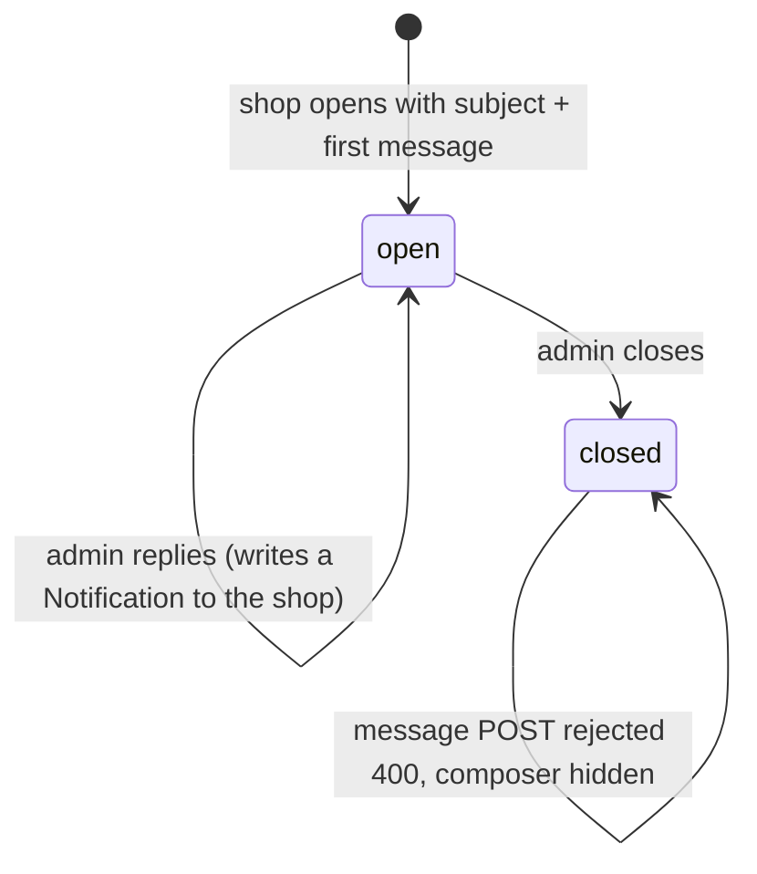
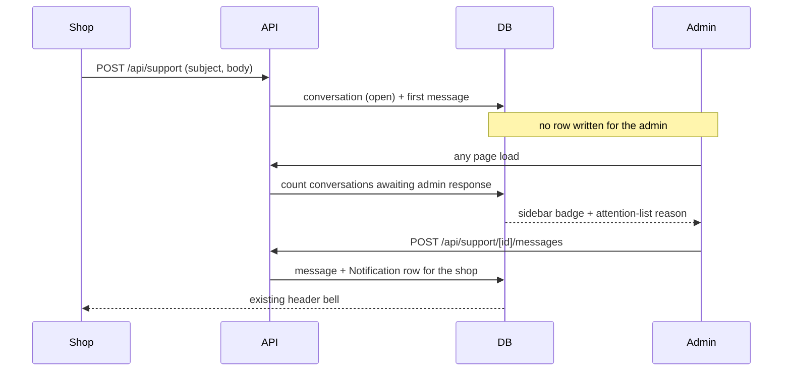

# Get Help & Support Conversations - Plan

## Goal Capsule

**Objective:** Give a shop a way to ask a question inside the portal and get an answer back, as a threaded conversation with portal admins, alerted in-portal on both sides.

**Authority hierarchy:** Product requirements (R-IDs) govern behavior. Key Technical Decisions (KTD-IDs) govern mechanism within those requirements. Implementation Units override neither.

**Stop conditions — surface as a blocker rather than guessing:**

- Delivering an alert would require changing the `Notification` model (nullable `shop_id`, an audience concept, or admin-addressed rows). That is out of scope by KTD3.
- A requirement here conflicts with the shop-scoping rule the existing API routes enforce.
- The work needs email to be useful. It does not — email is a separate, later layer.

**Execution profile:** Sequential. U1 establishes data; U2-U4 build the API surface; U5 and U6 are the two role-facing UIs and are independent of each other; U7 wires derived admin alerting.

**Tail ownership:** Standalone — the implementer owns review, commit, and PR.

---

## Product Contract

### Summary

A shop opens a conversation with a subject and a message. Portal admins reply inline, and either side can keep replying until an admin closes it. The shop is alerted through the notification bell it already has; admins are alerted by a sidebar badge and the existing "shops that need attention" list. No email, no attachments.

### Problem Frame

There is no way for a shop to ask a question inside the portal. The only contact route is a footer link to a generic Mobil contact page, which reaches nobody who runs this program.

The portal already carries half the machinery. `Notification` delivers messages to a shop and the header bell displays them, but the channel is one-way — there is no shop-to-admin direction and no admin-addressed notification of any kind. This feature adds the missing direction and closes the loop.

### Requirements

**Shop experience**

- R1. A shop user opens a conversation by supplying a subject and a first message.
- R2. A shop user sees every conversation belonging to their shop, with its status and whether it has unread admin replies.
- R3. A shop user reads a conversation's full message history and replies inline while it is open.
- R4. The support page shows `pgpsupport@steer.io` as a contact route for urgent issues.
- R5. Support is reachable at every program status, including `new`, `pending`, and `rejected`.

**Admin experience**

- R6. An admin sees conversations across all shops in one place, separated by open and closed.
- R7. An admin reads a conversation and replies inline.
- R8. An admin closes a conversation when it is resolved. Shops cannot close.
- R9. A closed conversation accepts no further messages from either side.

**Alerting**

- R10. An admin reply alerts the shop through the existing notification bell.
- R11. Open conversations awaiting an admin response are surfaced to admins by a sidebar badge and in the existing "shops that need attention" list.
- R12. Each side's unread state is tracked independently and clears when that side opens the conversation.

**Access control**

- R13. A shop user reaches only their own shop's conversations. An admin reaches all of them.
- R14. Every user attached to a shop sees and can reply to all of that shop's conversations, not only ones they opened.

### Scope Boundaries

In-portal only. Every alert in this plan is something a user sees after logging in.

#### Deferred to Follow-Up Work

- Attachments. Supabase storage already exists for invoices, so this is additive later.
- Assigning a conversation to a specific admin.
- Search across conversations.
- SLA, escalation, or any "nobody has responded" alerting.
- Reopening a closed conversation.
- Email delivery of either alert — see Risks & Dependencies.

---

## Planning Contract

### Key Technical Decisions

- KTD1. Two new models: `SupportConversation` (shop, opener, subject, status, per-side read stamps, timestamps) and `SupportMessage` (conversation, author, body, created_at). Both follow the repo's universal conventions — `String @id @default(dbgenerated("gen_random_uuid()")) @db.Uuid`, `@db.Timestamptz()` on every timestamp, snake_case `@@map`, and `onDelete: Cascade` on the relations that exist. Governs R1, R3.

- KTD2. **A message does not have a foreign key to `User`.** It stores `author_user_id` as a plain `@db.Uuid` column with no Prisma relation, plus `author_role` and `author_name`. Every relation in this schema is `onDelete: Cascade`, and deleting an admin is a live feature in `src/app/(portal)/admin/users/page.tsx` — an FK would delete a departed admin's replies and leave holes in conversations shops can still read. `Notification` sets the precedent by carrying no user reference at all. The cost is no referential integrity on the author and a denormalized name that does not follow a later rename. Governs R3, R7.

- KTD3. Admin-to-shop alerting reuses `Notification`; an admin reply writes one row for that shop and the existing bell renders it. Shop-to-admin alerting is **derived** — counted from conversation state, with no new notification rows. `Notification.shop_id` stays `NOT NULL` and no audience concept is introduced. *(session-settled: user-directed — chosen over building an admin notification channel: the model change is wider than it looks and the derived signal is enough without email.)* Governs R10, R11.

- KTD4. One exported helper defines "awaiting an admin response" and both admin surfaces call it — the sidebar badge and the `open_support_request` reason in `src/app/api/shops/attention/route.ts`. Two independent queries would drift and the two surfaces would silently disagree. Governs R11.

- KTD5. A closed conversation rejects a message from either side with 400, mirroring the already-approved check in `src/app/api/invoices/[id]/approve/route.ts`. The composer is hidden client-side once status is closed. This is what actually enforces "no reopening". Governs R9.

- KTD6. Read stamps live on the conversation, one per side, and are set when that side opens **that conversation** — not when it opens the list. The bell's mark-everything-on-open behavior is wrong here because a shop with several conversations would lose the ability to tell which one was answered. Governs R12.

- KTD7. Support is exempt from the enrollment redirect and appears in `enrollmentLinks` as well as `shopUserLinks` in `src/components/layout/sidebar.tsx`. *(session-settled: user-directed — chosen over approved-shops-only: a shop with a rejected invoice is exactly the shop that needs to ask why.)* Governs R5.

- KTD8. The admin surface is one cross-shop inbox at `/admin/support` with the thread in a `Dialog`, mirroring the review modal in `src/app/(portal)/admin/invoices/page.tsx`. Conversations need triage across shops, which a per-shop tab cannot give. Governs R6, R7.

- KTD9. `status` is a real Postgres enum (`open` / `closed`) mapped as `support_conversation_status`, matching how `InvoiceStatus` and `ProgramStatus` model status in this schema. Governs R8.

- KTD10. Conversations are scoped to the shop, not the opener — every user attached to the shop sees and can reply to all of them. This matches the shop-scoping every existing route uses and `Notification`'s shared-per-shop read state. Governs R14.

### Assumptions

- Shop users are content with a shared mailbox per shop. This follows every existing convention, but no user has used the feature yet to contradict it.

---

## High-Level Technical Design

Conversation status is a one-way door. The terminal guard in KTD5 is what keeps it that way.

The two alert directions are deliberately asymmetric — one is a stored row, the other is computed on read.

---

## Implementation Units

### U1. Data model and migration

**Goal:** The two tables exist and the app's hand-written types know about them.

**Requirements:** R1, R3 (KTD1, KTD2, KTD9)

**Dependencies:** none

**Files:**

- `prisma/schema.prisma` (modify)
- `prisma/migrations/20260810180000_add_support_conversations/migration.sql` (new)
- `src/types/database.ts` (modify)

**Approach:**

1. Add `SupportConversation`: shop relation with cascade, `opened_by_user_id` (plain `@db.Uuid`, no relation, per KTD2), `subject`, `status` enum defaulting to `open`, `shop_read_at` and `admin_read_at` as nullable timestamptz, `created_at`, `updated_at`.
2. Add `SupportMessage`: conversation relation with cascade, `author_user_id` (plain `@db.Uuid`), `author_role`, `author_name`, `body`, `created_at`.
3. Add the `support_conversations` back-relation to `Shop`, alongside the existing child arrays.
4. Index `shop_id` and `status` on the conversation and `conversation_id` on the message, matching the single-column FK indexing used elsewhere.
5. Hand-write the migration directory with a round timestamp. Mirror `prisma/migrations/20260724160000_add_notifications/migration.sql` exactly, including `CREATE TYPE` for the enum and a closing `ALTER TABLE ... ENABLE ROW LEVEL SECURITY;` for **both** tables with the existing explanatory comment.
6. Add matching interfaces to `src/types/database.ts`. This file is hand-maintained and is not the generated client — new models do not appear in it automatically. Follow its conventions: snake_case fields, `DateTime` as ISO `string`, nullable as `| null`, and the child array as optional (`messages?: SupportMessage[]`) like `InvoiceExtraction.line_items`.

**Patterns to follow:** `Notification` in `prisma/schema.prisma` for the shape of a shop-scoped child with a nullable read stamp; `20260724160000_add_notifications` for the migration file; the `Notification` interface in `src/types/database.ts`.

**Test expectation: none — schema and type declarations with no runtime behavior. U2 onward covers the behavior these tables carry.**

**Verification:** `npx prisma generate` succeeds and `npx tsc --noEmit` is clean with the new types referenced. The migration is **not** applied by this unit — see Risks & Dependencies.

### U2. Conversation list and creation API

**Goal:** A shop can open a conversation; both roles can list the ones they're allowed to see.

**Requirements:** R1, R2, R6, R13, R14 (KTD10)

**Dependencies:** U1

**Files:**

- `src/lib/validators/support.ts` (new)
- `src/app/api/support/route.ts` (new)
- `src/app/api/support/route.test.ts` (new)

**Approach:**

1. Validator: `subject` and `body`, both trimmed with a minimum of 1 and a sensible maximum, following `src/lib/validators/notification.ts`.
2. `GET` returns conversations for the caller's scope. Resolve the shop the way `src/app/api/notifications/route.ts` does — a `user` is forced onto `session.shopId`, an admin may pass `?shop_id=` and otherwise gets all shops. Order by `updated_at` descending so recent activity floats.
3. Include per-conversation unread state for the calling side, derived from the side's read stamp against the latest message time (KTD6).
4. `POST` creates the conversation and its first message in one `prisma.$transaction`. Take only `subject` and `body` from the client and read the shop from `session.shopId` — never accept a client-supplied shop id for a shop user.
5. Set `updated_at` explicitly. This schema has no `@updatedAt`, so it does not maintain itself, and the queue's ordering depends on it.

**Execution note:** Write the cross-shop access test before the handler. R13 is the requirement most likely to be quietly wrong, and it is invisible in manual testing.

**Patterns to follow:** `src/app/api/notifications/route.ts` for the auth gate, shop-scoping ternary, zod `safeParse` error shape, and `{ data }` / `{ error }` responses.

**Test scenarios:**

- An unauthenticated request is rejected 401.
- A shop user's GET returns only their own shop's conversations, ignoring a `?shop_id=` naming another shop.
- An admin's GET with no `shop_id` returns conversations across shops.
- POST creates a conversation with status `open` plus exactly one message, with the shop taken from the session.
- POST with an empty or whitespace-only subject is rejected 400 with field errors.
- POST sets `updated_at` on the new conversation.
- A conversation with a newer admin message than `shop_read_at` is reported unread to the shop.

**Verification:** A shop user cannot read another shop's conversations by any request they can construct.

### U3. Thread detail, replies, and read marking

**Goal:** Both sides can read a full conversation and reply, and opening it clears that side's unread state.

**Requirements:** R3, R7, R12, R13 (KTD2, KTD6)

**Dependencies:** U2

**Files:**

- `src/app/api/support/[id]/route.ts` (new)
- `src/app/api/support/[id]/messages/route.ts` (new)
- `src/app/api/support/[id]/route.test.ts` (new)
- `src/app/api/support/[id]/messages/route.test.ts` (new)

**Approach:**

1. `GET /api/support/[id]` returns the conversation with its messages oldest-first, after enforcing the same scope rule as U2. A shop user requesting another shop's conversation gets 404, not 403 — do not confirm existence.
2. The same handler sets the caller's side read stamp to now, per KTD6.
3. `POST /api/support/[id]/messages` appends a message. Derive `author_role` from the session and capture `author_name` at write time (KTD2) — never trust a client-supplied author.
4. In the same transaction, bump the conversation's `updated_at`, and when the author is an admin, create the `Notification` row that satisfies R10. Put the copy in `src/lib/notifications.ts` next to `SHOP_APPROVED_NOTIFICATION` rather than inline.
5. Dynamic route params are a promise in Next 16 — `const { id } = await params`.

**Patterns to follow:** `src/app/api/invoices/[id]/route.ts` for the dynamic-param and transaction shape; `src/lib/notifications.ts` for where alert copy lives.

**Test scenarios:**

- GET returns messages oldest-first for a conversation the caller owns.
- GET for another shop's conversation returns 404 for a shop user.
- GET as a shop user sets `shop_read_at`; GET as an admin sets `admin_read_at` and leaves the other untouched.
- A shop reply creates a message with role `user` and writes **no** notification.
- An admin reply creates a message and exactly one `Notification` for that conversation's shop.
- Any reply bumps the conversation's `updated_at`.
- An empty or whitespace-only body is rejected 400.
- The author fields are taken from the session even when the request body supplies different ones.

**Verification:** An admin reply produces both a message and a bell notification for the right shop; a shop reply produces neither.

### U4. Closing a conversation

**Goal:** An admin can resolve a conversation, and a closed one stops accepting messages.

**Requirements:** R8, R9 (KTD5)

**Dependencies:** U3

**Files:**

- `src/app/api/support/[id]/close/route.ts` (new)
- `src/app/api/support/[id]/close/route.test.ts` (new)
- `src/app/api/support/[id]/messages/route.ts` (modify — add the terminal guard)

**Approach:**

1. `POST /api/support/[id]/close` is admin-only, sets status to `closed`, and bumps `updated_at`.
2. Closing an already-closed conversation returns 400, matching the already-approved guard in `src/app/api/invoices/[id]/approve/route.ts`.
3. Add the terminal guard to the message handler from U3: a POST to a closed conversation is rejected 400 regardless of role. This guard, not the missing UI, is what enforces the deferred "no reopening" boundary.

**Execution note:** Write the closed-conversation rejection test first. A composer hidden in the UI looks like enforcement and is not.

**Patterns to follow:** the already-approved terminal check in `src/app/api/invoices/[id]/approve/route.ts`.

**Test scenarios:**

- A shop user's close attempt is rejected 401.
- An admin closes an open conversation and status becomes `closed`.
- Closing an already-closed conversation is rejected 400.
- A shop reply to a closed conversation is rejected 400.
- An admin reply to a closed conversation is rejected 400.

**Verification:** No request either role can construct adds a message to a closed conversation.

### U5. Shop support page

**Goal:** A shop can ask a question, read replies, and find the contact address — at any program status.

**Requirements:** R1, R2, R3, R4, R5 (KTD7)

**Dependencies:** U2, U3, U4

**Files:**

- `src/app/(portal)/support/page.tsx` (new)
- `src/components/layout/sidebar.tsx` (modify)

**Approach:**

1. Client page following the portal scaffold, but **without** the usual enrollment gate — this page must render for `new`, `pending`, and `rejected` shops (KTD7). Do not copy the `if (!isAdmin && (guardLoading || !isApproved)) return null` line from the other portal pages.
2. Conversation list with subject, status badge, last-activity time, and an unread marker. Show closed conversations with a badge rather than hiding them, matching how invoice lists present status.
3. A new-conversation form (subject + message) and a thread view with the message history and an inline reply box, hidden when status is closed.
4. A contact block showing `pgpsupport@steer.io` as informational text.
5. Add the Support link to **both** `shopUserLinks` and `enrollmentLinks` so it survives the sidebar's role/status link-set swap.
6. Re-fetch the list after any mutation rather than updating optimistically, matching the admin pages.

**Patterns to follow:** `src/app/(portal)/training/page.tsx` for the page scaffold and fetch idiom; `sonner` `toast` for feedback on shop-facing pages; the `statusColors` badge map convention from the admin pages.

**Test expectation: none — page component. `vitest.config.ts` includes only `src/**/*.test.ts`, so `.tsx` is excluded and no React testing libraries are installed. The behavior behind this page is covered by U2-U4; verify this unit in the running app.**

**Verification:** A shop with `program_status: "pending"` can reach `/support`, open a conversation, and is not redirected to `/enrollment`.

### U6. Admin support inbox

**Goal:** An admin can triage conversations across shops, reply, and close.

**Requirements:** R6, R7, R8 (KTD8)

**Dependencies:** U2, U3, U4

**Files:**

- `src/app/(portal)/admin/support/page.tsx` (new)
- `src/components/layout/sidebar.tsx` (modify)

**Approach:**

1. Client page listing conversations across all shops, partitioned into Open and Closed `Card`s with counts in the `CardTitle`, mirroring the three-bucket layout of the invoices page.
2. Sort open conversations so those awaiting an admin response come first, using the U7 helper's definition so the ordering matches the badge.
3. Thread view in a `Dialog` opened from a row, loading the detail on open, with the reply box and a Close button in the footer.
4. Client-side `isAdmin` gate plus the bare unauthorized fallback the other admin pages use; the API routes are the real enforcement.
5. Add the link to `adminLinks`.

**Patterns to follow:** `src/app/(portal)/admin/invoices/page.tsx` for the Card-per-bucket layout, the review `Dialog`, per-row action loading state, the local `formatApiError` helper, and re-fetch after mutation.

**Test expectation: none — page component, excluded from the vitest include pattern as in U5. Behavior is covered by U2-U4.**

**Verification:** An admin can open a conversation from any shop, reply, and close it, and the list reflects both without a manual refresh.

### U7. Derived admin alerting

**Goal:** Admins find out that conversations are waiting, from the surfaces they already use.

**Requirements:** R11 (KTD3, KTD4)

**Dependencies:** U1

**Files:**

- `src/lib/support.ts` (new)
- `src/lib/support.test.ts` (new)
- `src/app/api/support/awaiting/route.ts` (new)
- `src/app/api/shops/attention/route.ts` (modify)
- `src/components/layout/sidebar.tsx` (modify)

**Approach:**

1. Export one helper that answers "is this conversation awaiting an admin response" — open, with the latest message from the shop side, unread against `admin_read_at`. Both consumers use it so they cannot disagree (KTD4).
2. `GET /api/support/awaiting` returns the count for the sidebar badge, admin-only.
3. Add `open_support_request` to the `reasons` array in `src/app/api/shops/attention/route.ts` for shops with at least one awaiting conversation, and give it a badge on the dashboard alongside the existing reasons.
4. Add the badge to the admin sidebar link. Nothing in the sidebar fetches data today, so this introduces the first data fetch there — keep it to a single fetch on mount, matching `NotificationBell`, and do not add polling.

**Execution note:** Build the helper and its tests first, then wire both consumers to it. The point of this unit is that one definition feeds both surfaces.

**Patterns to follow:** the `reasons` array construction in `src/app/api/shops/attention/route.ts`; `NotificationBell` in `src/components/layout/header.tsx` for a badge fed by a single mount fetch; `src/lib/stock-up.ts` for a pure derived helper with its own unit tests.

**Test scenarios:**

- An open conversation whose latest message is from the shop and is newer than `admin_read_at` is awaiting.
- The same conversation after the admin opens it is not awaiting.
- An open conversation whose latest message is from an admin is not awaiting.
- A closed conversation is never awaiting, whatever the read stamps say.
- A conversation with no `admin_read_at` at all is awaiting.
- A shop with two awaiting conversations produces the reason once, not twice.

**Verification:** The sidebar badge count and the number of shops carrying `open_support_request` are consistent with each other for the same data.

---

## Verification Contract

- `npx vitest run` — the full suite passes, including the new route and helper tests. Note that only `src/**/*.test.ts` is collected; page components are out of scope for automated tests.
- `npx tsc --noEmit` — clean.
- `npx eslint src/app/api/support src/lib/support.ts src/app/\(portal\)/support src/app/\(portal\)/admin/support` — no new errors. The pre-existing `react-hooks/set-state-in-effect` warnings on data-fetching pages are known and not introduced here.
- Manual, after the migration is applied: open a conversation as a shop user, reply as an admin, confirm the bell notification arrives, close it, and confirm neither side can post afterwards.

---

## Definition of Done

**Global:**

- All seven units are implemented and their tests pass.
- No request either role can construct reads or writes another shop's conversation.
- A closed conversation rejects messages from both roles at the API, not only in the UI.
- The sidebar badge and the attention-list reason are fed by the same helper.
- Support is reachable by a shop at every program status.
- `Notification` is unchanged — no nullable `shop_id`, no audience concept.
- Abandoned or experimental code from the implementation is removed.

**Per unit:** each unit's test scenarios pass and its Verification line holds.

---

## Risks & Dependencies

**The migration must be applied by hand, and nothing works until it is.** This repo has no migrate script, and `prisma.config.ts` points migrations at `DIRECT_URL` because PgBouncer cannot run DDL. The implementer writes the migration; a human runs it. Every unit after U1 fails against a database without these tables. There is no data risk — the app is not live and there is nothing to back up or backfill.

**This plan and the email plan both edit the notification write path.** `docs/plans/2026-08-10-001-feat-email-notifications-plan.md` modifies `src/lib/notifications.ts` and `src/app/api/notifications/route.ts`, and U3 here adds alert copy to the same helper file. Whichever lands second will need to reconcile. They do not conflict in design, only in text.

**Admins only find out at next login, and that is the accepted limit of this design.** Every admin-facing alert here is computed when an admin loads a page. A shop can open a conversation and wait days if nobody logs in. This is why the contact address in R4 matters — it is the only route that does not depend on an admin being in the portal.

**Layering email on later needs a gap closed first.** The email plan resolves recipients as users linked to the shop. Admins are not shop-linked, so admin-directed email is a recipient path that plan does not currently have. Admin-to-shop email would work under the existing plan; shop-to-admin email would not, without that addition.

**A denormalized author name goes stale.** KTD2 trades referential integrity for message survival. If a user changes their name, older messages keep the old one. That is the deliberate cost of not letting a cascade delete conversation history.

---

## Sources

- `prisma/schema.prisma` — `Notification` as the model shape to mirror, and the universal ID, timestamptz, `@@map`, and cascade conventions.
- `prisma/migrations/20260724160000_add_notifications/migration.sql` — the migration template, including the required row-level-security block.
- `src/types/database.ts` — hand-maintained wire types that new models must be added to by hand.
- `src/app/api/notifications/route.ts` — the auth gate, shop-scoping ternary, validation, and response shapes every new route follows.
- `src/app/api/invoices/[id]/approve/route.ts` — the terminal-state guard KTD5 mirrors.
- `src/app/api/shops/attention/route.ts` — the `reasons` array U7 extends.
- `src/app/(portal)/admin/invoices/page.tsx` — the admin queue and review-`Dialog` pattern U6 mirrors.
- `src/components/layout/sidebar.tsx` — `shopUserLinks` / `enrollmentLinks` / `adminLinks`, the link-set swap KTD7 works around.
- `src/app/api/session/shop/route.test.ts` — the vitest route-test idiom, including the hand-rolled `@/lib/prisma` mock.
